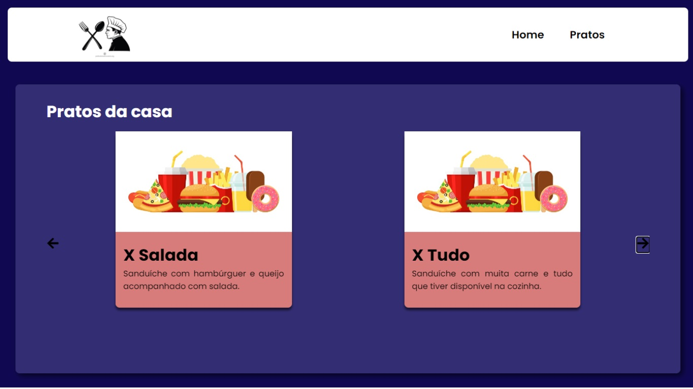
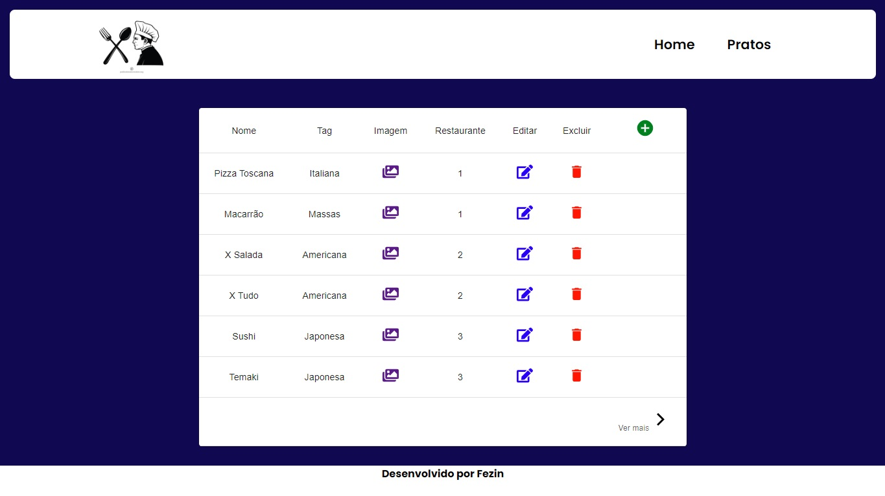

<h1>Aplicação para um restaurante</h1>

<h3>Este é um projeto simples desenovlvildo em react e suas tecnologias</h3>

Consiste em um cardapio online, onde é exibido todos os pratos de uma rede de restaurantes, totalmente integrado com api de JSON e banco de dados MySQL

<h4>Home page</h4>

<h4>Página de listagem dos pratos</h4>

<h4>Autor:</h4>

Felipe Antunes da Costa
